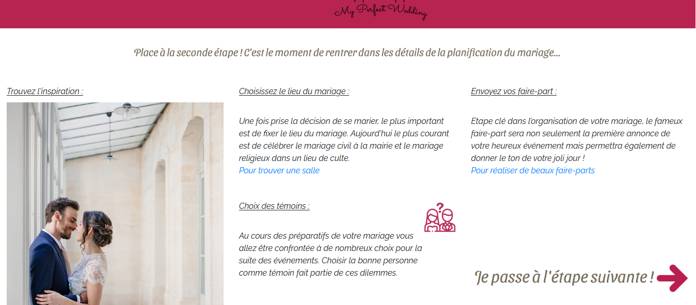
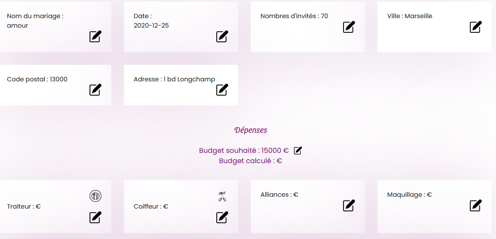
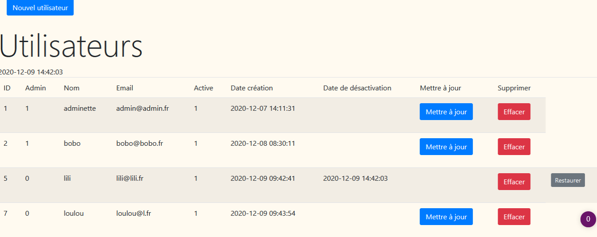

# Projet de fin de formation : PerfectWed

PerfectWed is an End Course Project of the Coding Academy by Epitech.

It has been realised during December 2020.

## Description
End Course Project.
It's a web site proposing an help to organize a wedding to a couple.
It proposes a board where to store all important datas (wedding place, number of guests, budget...). You can compare your budget to your expenses.
It also provides tips and links to help the organization.
In back-office, the administrator is able to Create/Read/Update/Delete every user or project.

## Install
You can find the code on github repository (https://github.com/Yann-Fontaine/pff). 
It requires Node.js, Composer and the setup of a database MySql.
In the root, run the different commands
```
npm install
composer install
```

### Compiles and hot-reloads for development
```
npm run dev
```

### Compiles and minifies for production
```
npm run build
```

### Compiles Laravel project
```
php artisan serve
```

## Preview and Screenshots






## Built with
- Laravel(https://laravel.com/)
- Laravel dependencies (Jetstream/Inertia)(https://jetstream.laravel.com/1.x/introduction.html)
- VueJS(https://vuejs.org/v2/guide/)
- MySQL(https://www.mysql.com/fr/)

## Authors
- Yann Fontaine
- Isabelle Manservisi  
- David Ta  
- Claire Wendlandt

## Project status
Made in 2 weeks, it's an End Course Project. 
Any contribution is welcome, but no maintenance is programmed.

## License
[MIT](https://choosealicense.com/licenses/mit/)
